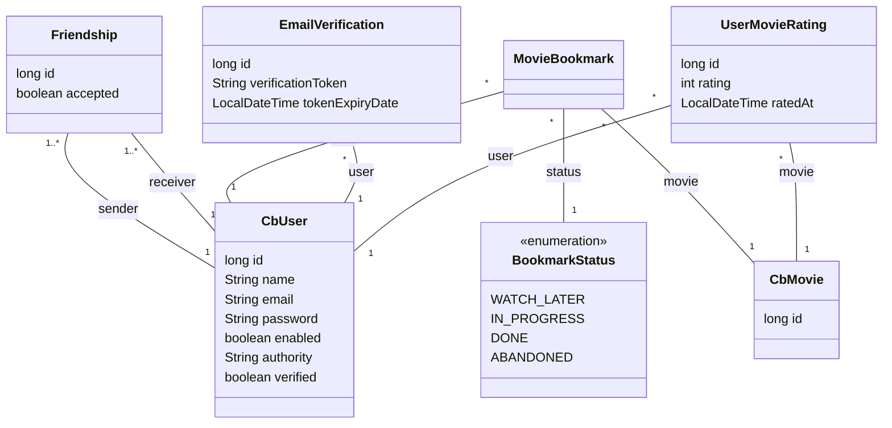

# Certified Bangers 💣️

Spring Boot web app that provides movie and TV show recommendations. Created in the course of the computer science
module "Softwareentwicklung (SW)" at OTH Regensburg.

## Quickstart

```sh
./mvnw spring-boot:run
```

## Required local properties

Place these secrets in `src/main/resources/application-local.properties`.

| Key                    | Content                                                 |
|------------------------|---------------------------------------------------------|
| `tmdb.api.key`         | [TMDB API Key](https://www.themoviedb.org/settings/api) |
| `spring.mail.username` | YOUR_EMAIL@gmail.com                                    |
| `spring.mail.password` | Google App Password (see below)                         |

## Class Diagram



## Email Verification Setup

The app uses email verification for new user registration. To enable this feature, you need to configure email settings
with your own credentials.
The setup that I built is suitable **for Gmail only**, so if you want to configure the app with a different email
service, the settings would look different.

### Prerequisites

- A Gmail account

### Step 1: Generate Google App Password

1. Go to your Google Account
2. Enable 2-Step Verification:
    - Click on `Security` in the left sidebar
    - Find `2-Step Verification` and turn it ON
3. Create App Password
    - In `Security` section, search for `App passwords` or go to: https://myaccount.google.com/apppasswords
    - Generate a password
    - Copy the 16-character password (it looks like: xxxx xxxx xxxx xxxx)
    - **Save this password** - you won't be able to see it again.

### Step 3: Configure `application-local.properties`

```properties
spring.mail.username=YOUR_EMAIL@gmail.com
spring.mail.password=YOUR_16_CHAR_APP_PASSWORD
```

### 📌 Important to note:

- The verification email might end up in your spam folder.

## Exam submission

There are three parts to the exam submission.

1. PDF Part including lean canvas and
   backlog: [Google Sheets](https://docs.google.com/spreadsheets/d/1GpOgG8HUAgziNxhD0JVqDjEqnBnJviiAjKFj3ZOB8ok/edit?usp=sharing).
2. ZIP Part including source code and user/admin manual: [This repo](https://github.com/noahjutz-2025-wise/sw-project)
3. Presentation: Maybe someone else can take the initiative on this.

## Definition of Done

- (V) There is a landing page
- (N) You can log in and sign up
- (A) Upon sign up, user can see recommendations and trending movies
- (V) There is one admin that can access the dashboard and ban users
- (N) The user can search any movie
- (N) The user can save a watchlist
- (A) The user can find other users
- (N) There is a published container image for the server
- (A) The web server sign-up confirmation E-mails to users
- (V) There is one error page in case of HTTP errors

## Roadmap

- 2025-10-16: Kickoff
    - [x] Come up with a product
    - [x] Create a lean canvas
    - [x] Define features (F)
    - [x] Developer environment setup (IntelliJ) and collaboration (PRs)
    - [ ] ~~Define initial user stories (US)~~
- 2025-10-23
    - [x] Review lean canvas, features and priorities
    - [x] Assign responsibilities to members (Feature Owners)
    - [X] High-Level architecture sketch
- 2025-10-30
    - [x] Review USs
    - [x] Definition of Done
    - [x] Resolve overlaps: F1/F7, F1/F4
    - [x] Assign F17 to A
- 2025-11-06
    - [x] Review PRs
    - [x] Define SQL Schema
- 2025-11-13
    - [x] Submit PDF Part
    - [x] Review code PRs
    - [x] Decide on formatter - [Spring Java Formatter](https://github.com/spring-io/spring-javaformat)
    - [x] Finalize Definition of Done
- 2025-12-04
    - [x] Assign Profile screen to F13 Friends & Profiles
    - [x] Assign Movie details screen to F7 Catalog & Details
- 2025-12-18
    - [x] Design decisions: Dedicated Search page with tabs (movies, shows, users). Replace home page with mood page.

## Further links

- [Miro Board](https://miro.com/app/board/uXjVJvcdTSM=/?share_link_id=283617943328)
